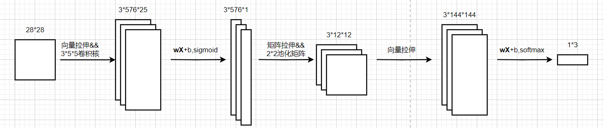
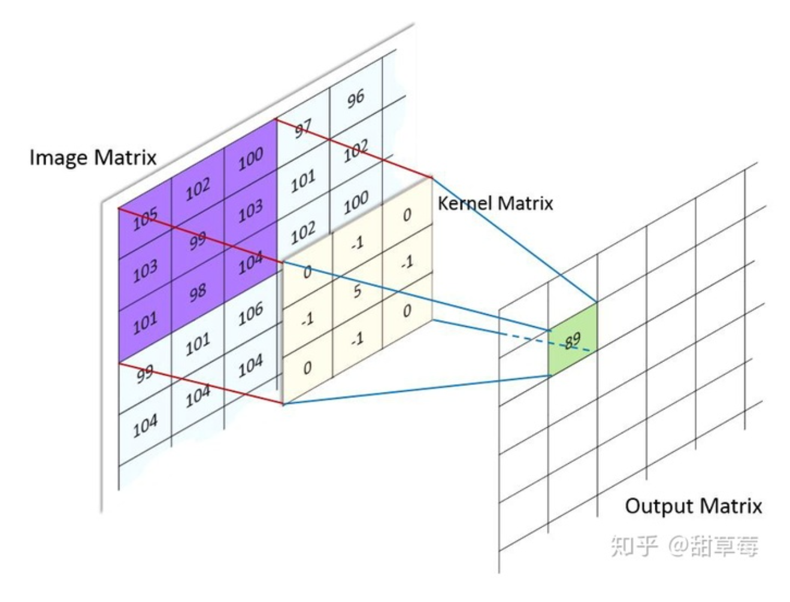
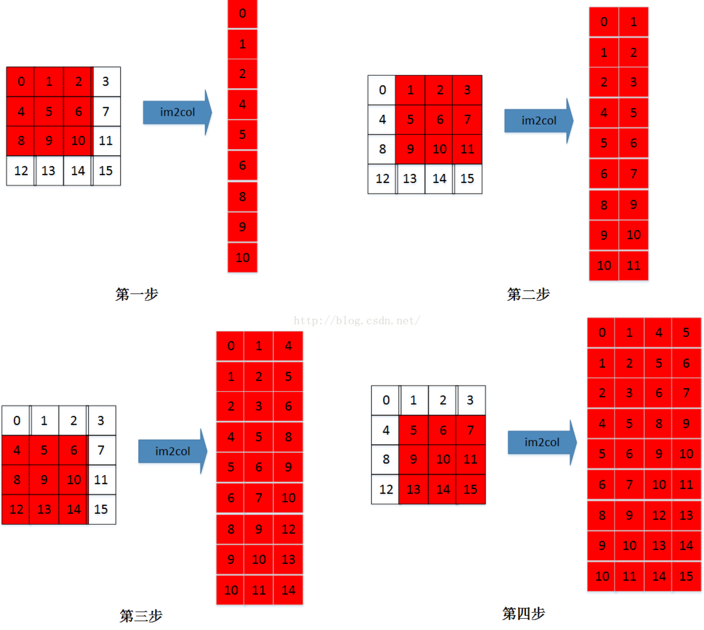

# 卷积神经网络

## **概述**

基础的**CNN**由 **卷积**(convolution), **激活**(activation), and **池化**(pooling)三种结构组成。CNN输出的结果是每幅图像的特定特征空间。当处理图像分类任务时，我们会把CNN输出的特征空间作为**全连接层或全连接神经网络**(fully connected neural network, FCN)的输入，用全连接层来完成从输入图像到标签集的映射，即分类。整个过程最重要的工作就是如何通过训练数据迭代调整网络权重，也就是**反向传播算法**

此次实验我们小组根据MNIST数据集的特征，设计了如下顺序的卷积神经网络：

**输入层**：N\*28\*28的原始数据，其中N代表训练集的图片数量。

**卷积层**：输入层结果为输入，3\*5\*5的卷积核，3\*24\*24的输出，激活函数采用sigmoid

**池化层**：卷积层结果为输入，2\*2的池化矩阵，3\*12\*12的池化层输出。

**全连接层**（输出层）：池化层结果为输入，激活函数采用softmax，输出为3类（0,1,2）对应的概率值。

**BP反向传播**：损失函数为交叉熵代价函数，从输出层依次向前求导修改权值和偏置。

补充：在卷积层和全连接层计算的时候采用了将矩阵拉伸成向量的方式加速计算。

整个网络结构大致如下图（以一张图为例子）：



## 输入层

### 1	原理分析

本次实验采用的是TensorFlow datasets中的mnist手写字：mnist返回为两个数组，第一个是一个n\*m维的 NumPy array，这里的 n 是样本数(行数)， m 是特征数(列数)。训练数据集包含 60,000 个样本， 测试数据集包含 10,000 样本。

 在 MNIST 数据集中的每张图片由 28 x 28 个像素点构成， 每个像素点用一个灰度值表示。我们将 28 x 28 的像素展开为一个一维的行向量，这些行向量就是图片数组里的行（每行 784 个值, 或者说每行就是代表了一张图片）。返回的第二个数组（labels） 包含了相应的目标变量，也就是手写数字的类标签(整数 0-9)。

本次实验要求仅使用到0,1,2的数据，因此在取训练集和测试集的时候会先对数据进行预处理。预处理部分还需要将图片数据从一维的1\*784转化成二维的28\*28，以便于后面计算使用。

### 2	关键代码实现

调用TensorFlow库获取数据集，并且按照shuffle的方式随机抽取加载，获得原始数据。

```python
data_mix = data_mix.shuffle(1024).batch(128).repeat(5).prefetch(10)
```

再将其抽取0,1,2数据进行保存，并且在数量达到预设值时候返回

```python
for i in range(labels.shape[0]):
    if labels[i] == 0 or labels[i] == 1 or labels[i] == 2:
        ret_data[total_count] = data[i]
        ret_label[total_count] = labels[i]
        total_count += 1
        #当数量达到要求的就返回
        if total_count == N:
            return ret_data,ret_label
```

## 卷积层

卷积层是整个卷积神经网络的核心部分，也是他与其他神经网络的区别所在。

### 1	原理分析

#### 1.1	卷积定义

CNN中最基础的操作是卷积convolution，再精确一点，基础CNN所用的卷积是一种2-D卷积。也就是说，kernel只能在x,y上滑动位移，不能进行深度 (跨通道) 位移。卷积层由一组滤波器组成，滤波器可以视为二维数字矩阵。

我们可以将滤波器与输入图像进行卷积来产生输出图像，具体的步骤如下：

1. 在图像的某个位置上覆盖滤波器；
2. 将滤波器中的值与图像中的对应像素的值相乘；
3. 把上面的乘积加起来，得到的和是输出图像中目标像素的值；
4. 对图像的所有位置重复此操作。

通常，卷积有助于我们找到特定的局部图像特征（如边缘），用在后面的网络中。

#### 1.2	卷积优点

卷积的优势主要体现在两点上：**1.局部感知，2.权值共享**

##### 1.2.1	局部感知

一般认为人对外界的认知是从局部到全局的，而图像的空间联系也是局部的像素联系较为紧密，而距离较远的像素相关性则较弱。因而，每个神经元其实没有必要对全局图像进行感知，只需要对局部进行感知，然后在更高层将局部的信息综合起来就得到了全局的信息。如下图则将3\*3的局部信息汇总到了1个神经元上，此时不仅能提取出局部的相关联信息，更重要的是减少了大量距离较远的神经元的，且不必要的计算。同时利用多个卷积核，则可以获取多个不同的特征用于提高最终分类的准确率。

##### 1.2.2	权值共享

这里的权值更多指的是卷积核上的权值。图像的一部分的统计特性与其他部分是一样的。这也意味着我们在这一部分学习的特征也能用在另一部分上，所以对于这个图像上的所有位置，我们都能使用同样的学习特征。这能大量减少计算的权值量，大幅提升模型训练的效率。



#### 1.3	卷积的参数

一般的卷积操作有如下几个常用的参数（公式）：

1. 输入体积的大小为
   $$
   H_1*W_1*D_1
   $$
   即原图像的长度、宽度和深度。

2. 四个超参数：

   a）.卷积核的数量K

   b）.卷积核的大小F

   c）.步长S

   d）.零填充大小P，其中零填充用于将卷积后的图像用0填充使得图像与原来大小相同。

3. 输出体积大小：
   $$
   H_2*W_2*D_2
   $$
   其中满足：
   $$
   H_2 = (H_1 - F + 2P)/S + 1\\
   W_2 = (W_1 - F + 2P)/S + 1\\
   D_2=K
   $$

### 2	关键代码实现

为了实现卷积的计算，我们代码的实现主要分成两部分：（此处相当于将卷积核分为形状和权值两部分，形状的计算通过a实现，权值通过b实现）

​	a）.将卷积核拉成向量，并且与图片数据进行卷积，这一部分实现通过im2col函数实现。

​	b）.将im2col计算后的结果再与权值和偏置进行线性变换，再通过sigmoid函数进行激活，得到输出。

#### 2.1	im2col实现

im2col实际是用于优化卷积运算，对于卷积核每一次要处理的小窗，将其展开到新矩阵的一行（列），新矩阵的列（行）数，就是对于一副输入图像，卷积运算的次数（卷积核滑动的次数），下面为示例图：



im2col实现代码：

1.首先通过原理分析中的公式，计算出卷积后矩阵的大小：

```python
out_h = int((H - core_h + pad * 2) / stride + 1)  # 纵向上能匹配卷积核几次
out_w = int((W - core_w + pad * 2) / stride + 1)  # 横向上能匹配卷积核几次
```

2.同时根据im2col的原理我们可以得到输出结果应该为“卷积后矩阵的大小\*卷积核的大小”：

```python
result = np.zeros((out_h * out_w, core_w * core_h))  # 每张图片拉伸之后的结果应该是如下矩阵：(匹配的卷积核次数，一个卷积核中的元素个数)
```

3.针对于每一次卷积核的匹配，保存拉伸后的向量存储到result对应的列中，并且最终返回im2col的结果。

```python
for w in range(out_w):
    max_w = w * stride + core_w
    for h in range(out_h):  # 在矩阵上移动卷积核
        max_h = h * stride + core_h
        i = 0
        for x in range(w * stride, max_w):
            for y in range(h * stride, max_h):  # 将卷积核内的小矩阵拉伸成一维向量
                result[w * h, i] = pad_image[x, y]
                i += 1
return result
```

#### 2.2	convolution实现

convolution实现相对简单，与一般的全连接神经网络计算方法类似，主要就是将im2col的结果与权值W进行向量乘积，再加上偏置矩阵即可。

```python
result = np.dot(X, W)
result += b  # WX+b
```

还需要通过sigmoid函数对结果进行激活：
$$
S(x)=\frac{1}{1+e^{-x}}
$$

```python
def sigmoid(X):
    for i in range(X.shape[0]):
        X[i][0] = 1 / (1 + exp(-X[i][0]))
    return X
```

